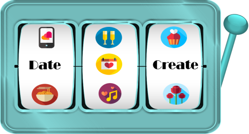

# DateCreate
Project 3
# Create Your Date App
When you don't know what to do today or tonight, let the app send you some where interesting and fun.

The Create your Date App is where you can come and select some data that will let the app arrive to a random date built just for you . 

### [Create your Date  Link]( https://reasonwithme.herokuapp.com/)



## Getting Started

These instructions will get you a copy of the project [Date Create ](https://github.com/habibtaghavi08/DateCreate) up and running on your local machine for development and testing purposes. See deployment for notes on how to deploy the project on a live system.

### Prerequisites

What things you need: 
* code editing [Visual Studio](https://visualstudio.microsoft.com/)
* work bench ui [robo3t](https://robomongo.org/)
* 
* 
* 


```
Open your Code editing software (example Visual Studio)

Open the "Terminal" in studio
perform a git clone https://github.com/habibtaghavi08/DateCreate.git
```

### Installing

After having the files cloned into your Studio, I would perform a 
* "Save Workspace AS" to have a workspace to come back to.
* Next you will need to install your code's Dependencies
    * This will capture all the items in your package.json file

See below on how to perform the install.

```
npm i
```
You will be installing the following npm packages:
* express
* express-handlebars
* mongoose
* cheerio
* axios 


Next open MySQL and create a new "connection"
* create a user name
* set up a pass word

Now you will create your own .env file in the root folder and enter the following info.


```
DBhost = "localhost"
DBuser = "root" or your username
DBPass = "root" or your pass word chosen

```
Now go into the (/models/schema.sql) and (seeds.sql) files and copy the information and enter into your workbench.
Be sure to run the code to create your DB (data base) and Tables.  Then on the seeds file, run that code to create the usable information.

## Running the server

Now you will want to run the web site locally.

### Right Click your server.js file and OPEN in Terminal

This will open your terminal in your "Root" folder and allow you to run the server "you may have done this already to get your  "npm i " completed

```
node server.js
```

### You should now see the serving running

click on the link to open your browser "local host"

```
Server listening on: http://localhost:8080
```

# Project work

## Deployment

We deployed with [Heroku](https://dashboard.heroku.com/apps)
using the the app [mLab](https://reasonwithme.herokuapp.com/)

#### read individual instructions for more detail

## The Web site was Built With

* [React](https://reactjs.org/) - The web framework used
* [Font Awesome](https://fontawesome.com/) - Icon and font
* [Node.js](https://nodejs.org/en/) - javascript, orm, connection and server.js files


## Project Team:
* **Dannielle Taylor** - *Project aspects of the app* - [d-taylor6403](https://github.com/d-taylor6403)
* **Mike Lusso** - *Project aspects of the app* - [Mlusso06](https://github.com/Mlusso06)
*  **Travis Bunn** - *Project aspects of the app* - [drtravis4](https://github.com/drtravis4)
*  **Celeste Lewis** - *Project aspects of the app* - [cdlewis42](https://github.com/cdlewis42)
* **Seyed Habib Taghavi** - *Project leader, Repo owner, and aspects of the app* -[habibtaghavi08](https://github.com/habibtaghavi08) 

## BootCamp Acknowledgments 

This project was part of the Vanderbilt coding Bootcamp - click [Vanderbilt](https://bootcamps.vanderbilt.edu/)  for details and how you can enroll.

## Acknowledgments

* Thanks to our Class instructor, and the TAs that have helped define and layout the expectations for the assignment. 